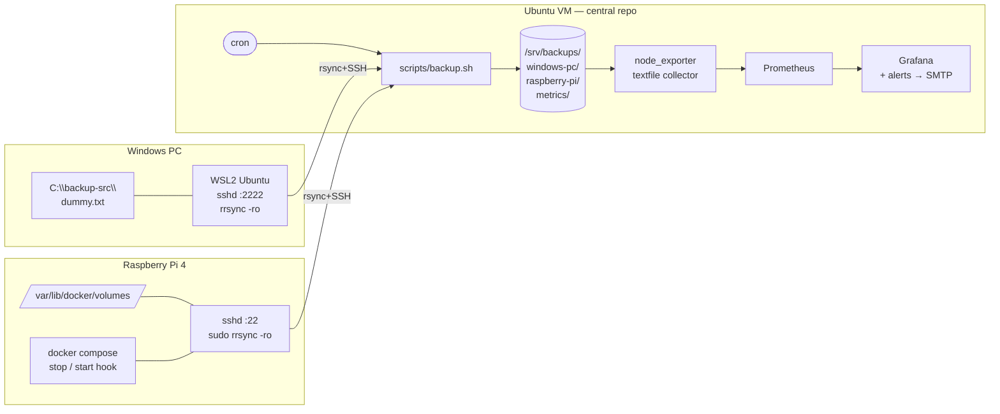

# Automated Cross-Platform Backup System

A small, secure, cron-driven backup system that pulls data from a **Windows PC** (user folder) and a **Raspberry Pi 4** (Docker volumes) into a central **Ubuntu VM** repository — with hardlink snapshots, SHA-256 integrity verification, and a Prometheus + Grafana monitoring stack.

Built around four unglamorous primitives that do the heavy lifting: **rsync**, **ssh**, **cron**, and **sha256sum**.

---

## Architecture



**Pull model.** Ubuntu is the only scheduler. Each source only needs an SSH account locked down to `rrsync`.

**Snapshots.** Each run creates a new timestamped directory under `/srv/backups/<source>/`. Unchanged files are hardlinked from the previous snapshot via `rsync --link-dest`, so disk use scales with *churn*, not total data.

**Integrity.** After each transfer a `MANIFEST.sha256` is written inside the snapshot. A weekly job re-validates the latest snapshot's manifest to detect silent bit-rot.

**Monitoring.** Scripts emit `.prom` text files that node_exporter scrapes. Grafana shows per-source status, capacity, and last-run duration; alerts (stale, failed, checksum-mismatch, disk-low, never-ran) fire to email via SMTP.

---

## Repository layout

```
config/          per-source .conf files + exclude lists
scripts/         backup.sh (generic driver), retention, verify, demo-local, install
ssh/             authorized_keys templates, Pi docker hook script, sudoers template
cron/            crontab installed under /etc/cron.d/backup
monitoring/      docker-compose stack: prometheus + grafana + node_exporter
docs/            architecture, per-host setup, monitoring, runbook
.github/         shellcheck + end-to-end demo CI
```

---

## Quickstart (Ubuntu repo host)

```bash
git clone <this-repo> /opt/backup
sudo /opt/backup/scripts/install.sh     # creates backup user, /srv/backups, /etc/backup, cron
cp /opt/backup/config/sources/windows-pc.conf.example /etc/backup/sources/windows-pc.conf
cp /opt/backup/config/sources/raspberry-pi.conf.example /etc/backup/sources/raspberry-pi.conf
sudo -u backup ssh-keygen -t ed25519 -f /home/backup/.ssh/id_backup_windows -N ''
sudo -u backup ssh-keygen -t ed25519 -f /home/backup/.ssh/id_backup_pi      -N ''
sudo -u backup ssh-keygen -t ed25519 -f /home/backup/.ssh/id_backup_pi_hook -N ''
# install the public keys on each source per ssh/authorized_keys.*.example
cd /opt/backup/monitoring && cp .env.example .env && $EDITOR .env && docker compose up -d
```

Then per-source setup:
- [docs/setup-windows.md](docs/setup-windows.md) — WSL2 + OpenSSH + rrsync
- [docs/setup-pi.md](docs/setup-pi.md) — sshd + sudoers + docker hook
- [docs/setup-ubuntu.md](docs/setup-ubuntu.md) — fuller walkthrough
- [docs/monitoring.md](docs/monitoring.md) — Grafana, dashboards, SMTP alerts
- [docs/runbook.md](docs/runbook.md) — "my backup just failed, now what?"

## Try it without any source hosts

```bash
./scripts/demo-local.sh
```

Spins up a fake source under `/tmp`, runs the full flow against localhost, verifies hardlink reuse, manifest integrity, retention, and checksum-failure detection. This is also what CI runs on every push.

---

## Security model (summary)

- **Pull only**, initiated by Ubuntu. Sources never reach out.
- **SSH keys only**, one keypair per (Ubuntu → source) pair.
- `authorized_keys` on each source pins the key to `rrsync -ro <dir>` (read-only, rooted). Pi data pull uses `sudo rrsync` to read `/var/lib/docker/volumes/` without running the backup user as root.
- `--fake-super` on Ubuntu stores owner/perm/xattr metadata in user xattrs — the receive side stays non-root.
- Pi `docker compose stop`/`start` is invoked via a **separate hook key** whose `authorized_keys` entry hard-whitelists two strings.
- SHA-256 manifests provide tamper and bit-rot detection independent of transport integrity.
- Grafana and Prometheus bind to `127.0.0.1` — access via SSH tunnel.

Full write-up in [docs/architecture.md](docs/architecture.md).

---

## Future work

- **At-rest encryption** of `/srv/backups` via LUKS (keyfile unlock at boot)
- **Off-site replication** to S3/B2 with object-lock immutability
- **Tailscale / VPN** for remote dashboard access
- **Detailed WSL2 networking guide** — `networkingMode=mirrored` on Win11 22H2+, `netsh portproxy` fallback for older builds
- **Rsync hardening flags** — `--bwlimit`, `--timeout`, `--contimeout`, `--info=stats2`
- **Per-source exclude defaults** — populate `config/excludes/*.txt` with sensible baselines (`$RECYCLE.BIN`, `Thumbs.db`, caches)
- **Bare-metal recovery tooling** — this is file-level only

---

## License

MIT — see [LICENSE](LICENSE).
